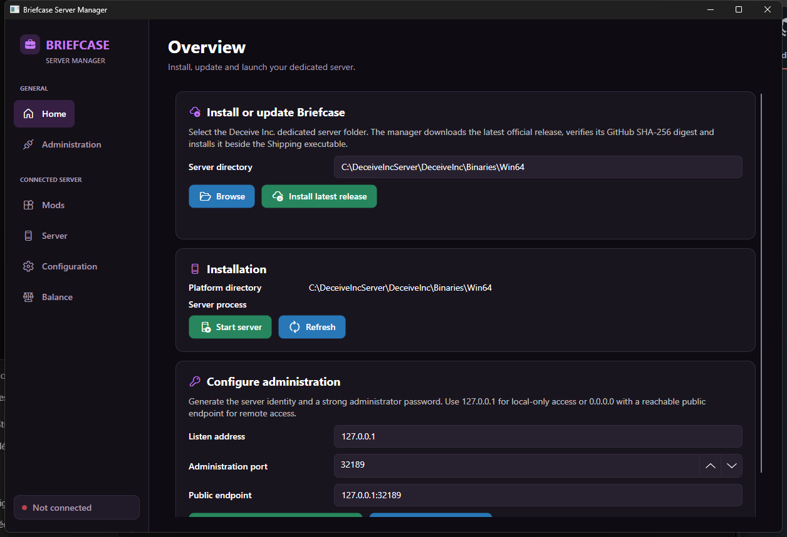
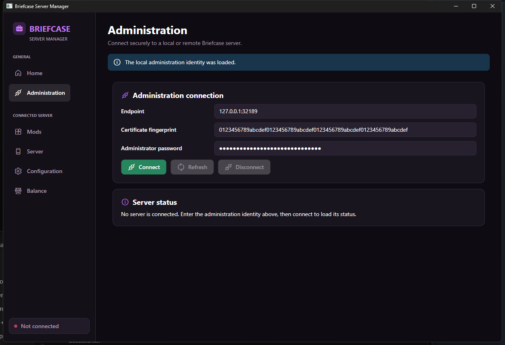
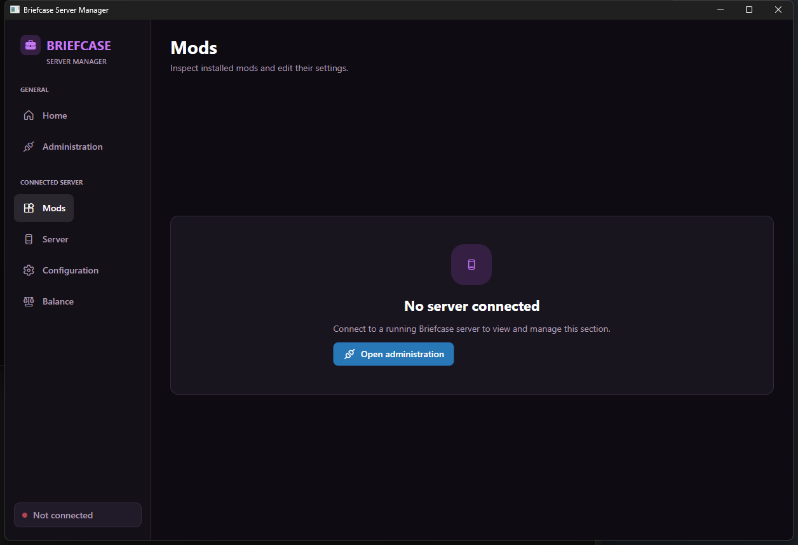

# Briefcase Server Manager

Briefcase Server Manager is the Windows application for installing, starting and administering a modded Deceive Inc. dedicated server. It is designed for server owners who have never used SteamCMD or Briefcase before. You do not need the modded game client, a terminal after the initial SteamCMD command, or the .NET runtime.

The manager can:

- find a Deceive Inc. dedicated server installation;
- download and safely install the latest official BriefcaseNative server release;
- start the server through the native, headless Briefcase launcher;
- create the administration identity and a strong password;
- connect securely to the local Briefcase administration service;
- configure mods, server settings, map rotation and balancing settings;
- view server logs and restart the server when changes must be applied.

> [!IMPORTANT]
> Briefcase Server Manager currently supports Windows. Always start the server through `Briefcase.ServerLauncher.exe`. Starting `DeceiveIncServer-Win64-Shipping.exe` directly bypasses Briefcase, its updater and its mod loader.

## What you need

Before you begin, make sure you have:

- a Windows PC on which the dedicated server will run;
- an internet connection for SteamCMD and the first Briefcase installation;
- enough free disk space for the dedicated server;
- permission to create folders and run applications on that PC.

This guide uses `C:\DeceiveIncServer` as the server folder. You may choose another folder, but keep the path simple and remember where it is.

## 1. Install the Deceive Inc. dedicated server

SteamCMD is Valve's command-line installer for dedicated servers. You only need to enter one command.

1. Create a folder named `C:\SteamCMD`.
2. Download the [official SteamCMD archive for Windows](https://steamcdn-a.akamaihd.net/client/installer/steamcmd.zip).
3. Extract `steamcmd.zip` into `C:\SteamCMD`. You should now have `C:\SteamCMD\steamcmd.exe`.
4. Create the empty folder `C:\DeceiveIncServer`.
5. Open `C:\SteamCMD` in File Explorer.
6. Click the address bar, type `powershell`, and press Enter. A PowerShell window opens in the correct folder.
7. Copy the following command, paste it into PowerShell, and press Enter:

```powershell
.\steamcmd.exe +force_install_dir "C:\DeceiveIncServer" +login anonymous +app_update 5007710 validate +quit
```

SteamCMD downloads the server without requiring a Steam account. Wait until it reports that app `5007710` was installed successfully. The executable should then exist here:

```text
C:\DeceiveIncServer\DeceiveInc\Binaries\Win64\DeceiveIncServer-Win64-Shipping.exe
```

If you chose another folder, replace `C:\DeceiveIncServer` in the command and in the following steps with your folder.

## 2. Download Briefcase Server Manager

1. Open the [latest Briefcase Server Manager release](https://github.com/EnoPM/Briefcase.ServerManager/releases/latest).
2. Under **Assets**, download the archive named `Briefcase.ServerManager-windows-x64-<version>.zip`.
3. Create a folder where you want to keep the manager, for example `C:\Briefcase Server Manager`.
4. Extract the downloaded ZIP archive into that folder.
5. Run `Briefcase.ServerManager.exe`.

The application is self-contained. You do not need to install .NET and you do not need to copy the manager into the game server folder.

Windows SmartScreen may display **Windows protected your PC** while the project is not code-signed. Only continue if you downloaded the executable from the official `EnoPM/Briefcase.ServerManager` release linked above. Select **More info**, verify the application name, then select **Run anyway**.

## 3. Install Briefcase on the server

The Home page contains everything needed for the first installation.



1. Select **Browse** next to **Server directory**.
2. Select either `C:\DeceiveIncServer` or `C:\DeceiveIncServer\DeceiveInc\Binaries\Win64`.
3. Check that the installation status identifies a valid Windows server.
4. Make sure the server process is stopped.
5. Select **Install latest release**.
6. Wait until the progress bar is complete and the success message appears.

The manager downloads Briefcase only from the official `EnoPM/BriefcaseNative` GitHub releases. It verifies the downloaded file and every package entry before replacing anything. If installation fails, read the message shown at the top of the page before trying again.

Briefcase is installed inside the server's `Win64` folder. Your mods and configuration are kept under its `Briefcase` directory.

## 4. Configure local administration

Administration uses an encrypted connection, a certificate fingerprint and a password. The manager can generate all of them for you.

For a first installation on one PC, keep these values on the Home page:

| Setting | Value | Meaning |
| --- | --- | --- |
| Listen address | `127.0.0.1` | Only applications on this PC can connect. |
| Administration port | `32189` | The local TCP port used by Briefcase. |
| Public endpoint | `127.0.0.1:32189` | The address entered by Server Manager. |

Select **Generate administration password**. Briefcase creates a strong random password and a TLS identity, stores them in the server installation, and fills the Administration page for the current session.

The files are stored here:

```text
C:\DeceiveIncServer\DeceiveInc\Binaries\Win64\Briefcase\Admin\server.json
C:\DeceiveIncServer\DeceiveInc\Binaries\Win64\Briefcase\Admin\pairing.json
```

- `server.json` contains the private administration password. Do not publish or share it.
- `pairing.json` contains the endpoint and certificate fingerprint needed by an administration client.

Briefcase also creates these files automatically with the same local-only defaults on the first successful server start. If they already exist, select **Load existing identity** instead of generating a new password. This loads the endpoint, fingerprint and password into Server Manager.

> [!NOTE]
> `127.0.0.1` deliberately limits administration to the server PC. It is the safest and simplest setup for a first installation. Remote administration requires a suitable listen address plus firewall and network configuration; do not expose the administration port to the internet unless you understand those settings.

## 5. Start the server and connect

1. Return to **Home**.
2. Select **Start server**.
3. Wait for the server process status to show that it is running.
4. Open **Administration** in the left menu.
5. Check that the endpoint is `127.0.0.1:32189`, the fingerprint is filled in and the password field is not empty.
6. Select **Connect**.



The connection badge at the bottom of the navigation bar becomes green after a successful connection. Server Manager then loads the server status, installed mods and configuration.

If the fields are empty, return to Home and select **Load existing identity**. If connection still fails, confirm that the server was started with **Start server** and is still running.

## 6. Administer the server

The pages that contain server data stay unavailable until Server Manager is connected. This avoids presenting empty controls as if the server had no configuration.



After connecting, use the pages in the left menu:

### Mods

View every installed native mod, its version and its current state. Open a mod to edit the settings it exposes through Briefcase. Save the changes before leaving the page.

### Server

View the server status, enable or disable installed mods, read recent logs and request a restart. Use **Refresh logs** to fetch newer entries. Use **Restart server** after saving settings that are applied during startup.

### Configuration

Edit server gameplay, network and map settings. Map rotation uses named map entries that you can enable and reorder instead of requiring internal map codes in a text field. Select the save button after making changes.

### Balancing

Choose a character or balance group, edit the exposed character, weapon and gameplay values, then save them. Restart the server when the page tells you that the new values are applied at startup.

Server Manager uses secure request-and-response messages rather than a continuously streamed WebSocket connection. Use the blue refresh buttons when you want the latest status or logs.

## Everyday use

For later sessions, the usual sequence is:

1. Run `Briefcase.ServerManager.exe`.
2. Confirm the saved server directory on Home.
3. Select **Install latest release** when you want to update Briefcase while the server is stopped.
4. Select **Start server**.
5. Select **Load existing identity** if the administration fields are not already populated.
6. Open Administration and select **Connect**.
7. Make and save your changes.
8. Restart the server from the Server page when required.

The native launcher checks for Briefcase and mod updates before starting or restarting the dedicated server. Updates that affect early-loaded mods are therefore installed before the game process begins.

## Troubleshooting

### The manager cannot find the dedicated server

Select `C:\DeceiveIncServer` or its `DeceiveInc\Binaries\Win64` folder. This file must exist below the selected directory:

```text
DeceiveInc\Binaries\Win64\DeceiveIncServer-Win64-Shipping.exe
```

If it is missing, run the SteamCMD installation command again and wait for it to finish.

### Install or update is refused

Stop the dedicated server first. Server Manager deliberately refuses to replace Briefcase files while that server process is running. Then select **Refresh** on Home and try **Install latest release** again.

### The Administration page has empty fields

Select the server directory on Home, then select **Load existing identity**. If no identity exists yet, select **Generate administration password**. Check that both `Briefcase\Admin\server.json` and `Briefcase\Admin\pairing.json` were created.

### Connection is refused

Check each of the following:

- the server was started through **Start server** or `Briefcase.ServerLauncher.exe`;
- its process is still running;
- the endpoint is exactly `127.0.0.1:32189` for the default local setup;
- the fingerprint and password were loaded from the same server installation;
- another application is not already using port `32189`.

### Mods, Configuration or Balancing says that no server is connected

Open Administration and select **Connect**. These pages require an active administration connection and are cleared when the server stops or restarts.

### A saved setting has not changed in game

Read the success message after saving. Settings and mods that load during startup require **Restart server** on the Server page before they take effect.

### The game was updated and Briefcase rejects the build

Do not bypass the build check. Install a Briefcase release that explicitly supports the new Deceive Inc. server build.

## Security

The installer accepts release metadata only from `EnoPM/BriefcaseNative`, follows downloads only to GitHub release hosts, verifies the GitHub SHA-256 digest and validates every package file against `Package.json`. Archive traversal, linked installation directories, oversized files and unsupported game builds are rejected.

The administration client validates the exact SHA-256 fingerprint of the server certificate before sending the password. TLS 1.2 or TLS 1.3 is required. Keep `Briefcase\Admin\server.json` private and prefer the default local-only address when Server Manager runs on the server PC.

The single-file application verifies the size and SHA-256 digest of every embedded application file before launch. Modified cache entries are replaced from the executable on the next start.

## Development

Open `Briefcase.ServerManager.slnx` in JetBrains Rider. The UI uses Avalonia 12.1.2 with XAML views and Fluent UI System Icons, and targets .NET 10 Native AOT for Windows x64.

```powershell
dotnet restore Briefcase.ServerManager.slnx
dotnet build Briefcase.ServerManager.slnx -c Release
dotnet run --project tests/Briefcase.ServerManager.Contracts -c Release
.\scripts\Publish-SingleFile.ps1 -Platform windows-x64 -NoRestore
```

See [CONTRIBUTING.md](CONTRIBUTING.md) for repository rules.
